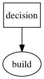
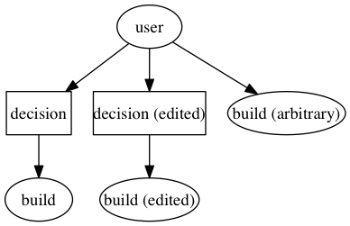
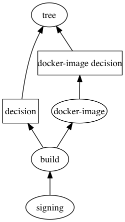

# Chain of Trust
## Releng Tech Talk
### Sep 2017

---

## Taskcluster

- massively scalable
- self-serve, powerful
- security challenge

Note:
- Taskcluster is massively scalable... We spin up about 10 million worker instances per year.
- It's self serve, which allows developers to push all their changes without being blocked by releng.
- By its nature, it presents a security challenge for releases.

---

## Taskcluster scopes

Permissions to trigger valid task == permissions to trigger arbitrary task

Note:
- Scopes are Taskcluster's permissions model.
- If you have the scopes to trigger a valid task, you have the scopes to trigger an arbitrary or malicious task. It's all the same to Taskcluster.

---

## Chain of Trust

- A way to trace a request back to the tree.
- A <a href="https://en.wikipedia.org/wiki/Multi-factor_authentication#Possession_factors">second factor</a>, based on something the worker has.

Note:
- The chain of trust is a way to trace a request back to the tree.
- The chain of trust is a second factor, based on something the worker has.

---

When you push to the tree, the decision task creates a task graph.

A super-minimal example task graph containing a single build:



---

If you have the scopes to trigger or retrigger an official task graph, you also have the scopes to trigger any arbitrary task with the same permissions.



---

We want to allow this flexibility in general, but restrict release tasks.

---

How do we trust Taskcluster for sensitive processes and secrets?

- the secrets must be protected by more than just scopes
- we need to know the request is valid (trace back to tree)

---

Protecting secrets: scriptworker

- under releng control
- static/limited abilities (no bash scripts in task definitions)
- verifies request validity before proceeding

---

Request validity: Chain of Trust

- releng needs to safeguard everything from hg.m.o all the way to the user
- hg.m.o security is a separate problem
- trace the request back to the tree via the chain of trust

---

What is the chain of trust?

A way to trace a request back to the tree.

---

Attack vectors

- altered or arbitrary task definition
- malicious docker image
- alter artifacts at rest
- alter pointers to artifacts, like moving softlinks

---

### Chain of Trust
### artifact generation

---

Each important level3 worker has an embedded gpg key.

- docker-worker: the key lives outside the container
- generic-worker: the key is not readable by the task user
- scriptworker: the worker is limited and under releng control

---

Chain of Trust artifact

```python
-----BEGIN PGP SIGNED MESSAGE-----
Hash: SHA256

{
  "artifacts": {
    "path/to/artifact": {
      "sha256": "abcd1234"
    },
    ...
  },
  "chainOfTrustVersion": 1,
  "environment": {
    # worker-impl specific stuff, like ec2 instance id, ip
  },
  "task": {
    # task defn
  },
  "runId": 0,
  "taskId": "...",
  "workerGroup": "...",
  "workerId": "..."
}
-----BEGIN PGP SIGNATURE-----
...
-----END PGP SIGNATURE-----
```

@[11](chain of trust version 1 schema)
@[5-10](artifact paths and shas)
@[12-14](worker info)
@[15-17](task definition)
@[18-21](worker/task metadata)
@[1-2](gpg signed)

---

After the task finishes, the worker

- calculates artifact shas
- creates the cot artifact
- signs it
- uploads it with the other artifacts

---

GPG keys

- keypairs are valid per worker impl
- valid keys for level3 only
- allow us to verify valid chain of trust artifacts
- 4 gpg homedirs allow us to have different trust models between worker impls

---

### Chain of Trust verification

---

- inspect every important upstream task (any upstream task that can create or modify inputs is important)
- make sure task definitions have not been modified from the original `task-graph.json`
- upstream artifacts must match shas in chain of trust artifact
- restricted scopes can only run on allowlisted trees

---

Trace back to the tree



---

Chain of Trust verification: building the chain

- add self and decision task to chain
- add any docker-image tasks to chain
- add upstream artifact tasks to chain
- trace every upstream task to their decision task(s)

---

signing task

```json
{
  "provisionerId": "scriptworker-prov-v1",
  "workerType": "signing-linux-v1",
  "schedulerId": "gecko-level-3",
  "taskGroupId": "UnU2jpdcQheHKXpI3HHXsQ",
  "dependencies": [
    "el2acWweT5a6rYhb19RBRw"
  ],
  "requires": "all-completed",
  "routes": [
    "index.gecko.v2.mozilla-central.signed-nightly.nightly.latest.firefox.linux-opt",
    "index.gecko.v2.mozilla-central.signed-nightly.nightly.2017.06.26.revision.d50abca6521baeae8ac6b07ddf843d63a1aa5f84.firefox.linux-opt",
    "index.gecko.v2.mozilla-central.signed-nightly.nightly.2017.06.26.latest.firefox.linux-opt",
    "index.gecko.v2.mozilla-central.signed-nightly.nightly.revision.d50abca6521baeae8ac6b07ddf843d63a1aa5f84.firefox.linux-opt",
    "index.gecko.v2.mozilla-central.signed-nightly.revision.d50abca6521baeae8ac6b07ddf843d63a1aa5f84.firefox-l10n.linux-opt.en-US",
    "index.gecko.v2.mozilla-central.signed-nightly.pushdate.2017.06.26.20170626100316.firefox-l10n.linux-opt.en-US",
    "index.gecko.v2.mozilla-central.signed-nightly.latest.firefox-l10n.linux-opt.en-US",
    "project.releng.funsize.level-3.mozilla-central",
    "tc-treeherder.v2.mozilla-central.d50abca6521baeae8ac6b07ddf843d63a1aa5f84.-1",
    "tc-treeherder-stage.v2.mozilla-central.d50abca6521baeae8ac6b07ddf843d63a1aa5f84.-1"
  ],
  "priority": "medium",
  "retries": 5,
  "created": "2017-06-26T10:06:56.798Z",
  "deadline": "2017-06-27T10:06:56.798Z",
  "expires": "2018-06-26T10:06:56.798Z",
  "scopes": [
    "project:releng:signing:cert:nightly-signing",
    "project:releng:signing:format:gpg",
    "project:releng:signing:format:mar"
  ],
  "payload": {
    "maxRunTime": 3600,
    "upstreamArtifacts": [
      {
        "paths": [
          "public/build/target.tar.bz2"
        ],
        "formats": [
          "gpg"
        ],
        "taskId": "el2acWweT5a6rYhb19RBRw",
        "taskType": "build"
      },
      {
        "paths": [
          "public/build/update/target.complete.mar"
        ],
        "formats": [
          "mar"
        ],
        "taskId": "el2acWweT5a6rYhb19RBRw",
        "taskType": "build"
      }
    ]
  },
  "metadata": {
    "owner": "nobody@mozilla.org",
    "source": "https://hg.mozilla.org/mozilla-central/file/d50abca6521baeae8ac6b07ddf843d63a1aa5f84/taskcluster/ci/build-signing",
    "description": "Linux32 Nightly ([Treeherder push](https://treeherder.mozilla.org/#/jobs?repo=mozilla-central&revision=d50abca6521baeae8ac6b07ddf843d63a1aa5f84)) Signing ([Treeherder push](https://treeherder.mozilla.org/#/jobs?repo=mozilla-central&revision=d50abca6521baeae8ac6b07ddf843d63a1aa5f84))",
    "name": "signing-linux-nightly/opt"
  },
  "tags": {
    "createdForUser": "nobody@mozilla.org"
  },
  "extra": {
    "treeherderEnv": [
      "production",
      "staging"
    ],
    "treeherder": {
      "jobKind": "build",
      "groupSymbol": "tc",
      "collection": {
        "opt": true
      },
      "machine": {
        "platform": "linux32"
      },
      "groupName": "Executed by TaskCluster",
      "tier": 1,
      "symbol": "Ns"
    }
  }
}
```

@[33-34](payload only defines `maxRunTime` and `upstreamArtifacts`)
@[36-43](`upstreamArtifacts` defines paths, signing formats, taskId, taskType)
@[28-30](formats and cert type specified by scopes)
@[5](`taskGroupId` == decision task `taskId`)
@[6-8](`dependencies` - debating whether we can ignore these eventually)
@[42](`upstreamArtifacts` `taskId`s)
@[24-26](datestrings are allowed to change)

---

decision task cot

```json
{
    "chainOfTrustVersion": 1,
    "artifacts": {
        "public/action.yml": {
            "sha256": "f9b3ebf13ae89bf50ac8f3f4320275f4431f34984d34515d78f150618846a78b"
        },
        "public/actions.json": {
            "sha256": "7d149569c1f14dca6c470f9ea85f8b70a061062f98c021b9ceae27f5c82207ca"
        },
        "public/full-task-graph.json": {
            "sha256": "9f37e54034ff7e5486a9448361876a280a75dac3f62c2f619023e8b54e926528"
        },
        "public/label-to-taskid.json": {
            "sha256": "cdf776d1867fc892d21578cacf9e028f9e226b926271836061af982f3df85054"
        },
        "public/parameters.yml": {
            "sha256": "7f25a3fd40f7a920c300e05da2dcbd8a37d287222a6367696e230c1ed7324778"
        },
        "public/target-tasks.json": {
            "sha256": "b725bd09aaa7c36b723ac85ec7cdc55b5ae75271dbbc744368150706b037a47f"
        },
        "public/task-graph.json": {
            "sha256": "739e9bed32200f4877a9ab8687a54bc94cbb59513e6d8e76b88599b7379d3632"
        },
        "public/logs/certified.log": {
            "sha256": "8c2d3db9b56b8b545ad31281343037f2fc877dfa3155b0c9dffa5deefca646a6"
        }
    },
    "task": {
        "provisionerId": "aws-provisioner-v1",
        "workerType": "gecko-decision",
        "schedulerId": "gecko-level-3",
        "taskGroupId": "UnU2jpdcQheHKXpI3HHXsQ",
        "dependencies": [],
        "requires": "all-completed",
        "routes": [
            "index.gecko.v2.mozilla-central.latest.firefox.decision",
            "tc-treeherder.v2.mozilla-central.d50abca6521baeae8ac6b07ddf843d63a1aa5f84.-1",
            "tc-treeherder-stage.v2.mozilla-central.d50abca6521baeae8ac6b07ddf843d63a1aa5f84.-1",
            "notify.email.nobody@mozilla.org.on-failed",
            "notify.email.nobody@mozilla.org.on-exception"
        ],
        "priority": "lowest",
        "retries": 5,
        "created": "2017-06-26T10:01:52.607Z",
        "deadline": "2017-06-27T10:01:52.607Z",
        "expires": "2018-06-26T10:01:52.607Z",
        "scopes": [
            "assume:repo:hg.mozilla.org/mozilla-central:cron:nightly-desktop"
        ],
        "payload": {
            "features": {
                "taskclusterProxy": true,
                "chainOfTrust": true
            },
            "artifacts": {
                "public": {
                    "path": "/home/worker/artifacts",
                    "expires": "2018-06-25T10:01:52.607322Z",
                    "type": "directory"
                }
            },
            "image": "taskcluster/decision:0.1.8@sha256:195d8439c8e90d59311d877bd2a8964849b2e43bfc6c234092618518d8b2891b",
            "cache": {
                "level-3-checkouts": "/home/worker/checkouts"
            },
            "maxRunTime": 1800,
            "command": [
                "/home/worker/bin/run-task",
                "--vcs-checkout=/home/worker/checkouts/gecko",
                "--",
                "bash",
                "-cx",
                "cd /home/worker/checkouts/gecko && ln -s /home/worker/artifacts artifacts && ./mach --log-no-times taskgraph decision --pushlog-id='-1' --pushdate='0' --project='mozilla-central' --message=\"no push -- cron task 'nightly-desktop'\" --owner='nobody@mozilla.org' --level='3' --base-repository='https://hg.mozilla.org/mozilla-central' --head-repository='https://hg.mozilla.org/mozilla-central' --head-ref='d50abca6521baeae8ac6b07ddf843d63a1aa5f84' --head-rev='d50abca6521baeae8ac6b07ddf843d63a1aa5f84' --target-tasks-method=nightly_linux"
            ],
            "env": {
                "GECKO_HEAD_REPOSITORY": "https://hg.mozilla.org/mozilla-central",
                "HG_STORE_PATH": "/home/worker/checkouts/hg-store",
                "GECKO_HEAD_REF": "d50abca6521baeae8ac6b07ddf843d63a1aa5f84",
                "GECKO_BASE_REPOSITORY": "https://hg.mozilla.org/mozilla-unified",
                "GECKO_HEAD_REV": "d50abca6521baeae8ac6b07ddf843d63a1aa5f84"
            }
        },
        "metadata": {
            "owner": "mozilla-taskcluster-maintenance@mozilla.com",
            "source": "https://hg.mozilla.org/mozilla-central",
            "name": "Decision task for cron job nightly-desktop",
            "description": "Created by a [cron task](https://tools.taskcluster.net/task-inspector/#HVrunwopQr-syj9eV6zeTw/)"
        },
        "tags": {
            "createdForUser": "nobody@mozilla.org"
        },
        "extra": {
            "treeherder": {
                "symbol": "Nd",
                "groupSymbol": "cron"
            }
        }
    },
    "taskId": "UnU2jpdcQheHKXpI3HHXsQ",
    "runId": 0,
    "workerGroup": "us-east-1",
    "workerId": "i-015de65c860bebb81",
    "environment": {
        "publicIpAddress": "34.204.78.238",
        "privateIpAddress": "172.31.8.235",
        "imageHash": "sha256:a22b90c7e16191a701760ef4f9159e86289ba598bf8ff5b22b7b94867530460d",
        "instanceId": "i-015de65c860bebb81",
        "instanceType": "r3.xlarge",
        "region": "us-east-1a"
    }
}
```

@[31](decision task `workerType` allowlist)
@[54](enable chain of trust generation)
@[68-75](command parsing / verification)
@[107](docker image sha should be in allowlist)
@[77-81](points at tree)
@[22-24](`task-graph.json` contains all child task definitions)

---

`task-graph.json`

```json
{
  "el2acWweT5a6rYhb19RBRw": {
    "attributes": {
      "build_platform": "linux-nightly",
      "build_type": "opt",
      "kind": "build",
      "nightly": true,
      "run_on_projects": [
        "all"
      ]
    },
    "dependencies": {},
    "kind": "build",
    "label": "build-linux-nightly/opt",
    "optimizations": [],
    "task": {
      "created": {
        "relative-datestamp": "0 seconds"
      },
      "deadline": {
        "relative-datestamp": "1 day"
      },
      "expires": {
        "relative-datestamp": "1 year"
      },
      "dependencies": [
        "Pr9OcxSqQlOjbytRDpHd2g"
      ],
      "extra": {
        "chainOfTrust": {
          "inputs": {
            "docker-image": "Pr9OcxSqQlOjbytRDpHd2g"
          }
        },
        "index": {
          "rank": 1498471396
        },
        "treeherder": {
          "collection": {
            "opt": true
          },
          "groupName": "Executed by TaskCluster",
          "groupSymbol": "tc",
          "jobKind": "build",
          "machine": {
            "platform": "linux32"
          },
          "symbol": "N",
          "tier": 1
        },
        "treeherderEnv": [
          "production",
          "staging"
        ]
      },
      "metadata": {
        "description": "Linux32 Nightly ([Treeherder push](https://treeherder.mozilla.org/#/jobs?repo=mozilla-central&revision=d50abca6521baeae8ac6b07ddf843d63a1aa5f84))",
        "name": "build-linux-nightly/opt",
        "owner": "nobody@mozilla.org",
        "source": "https://hg.mozilla.org/mozilla-central/file/d50abca6521baeae8ac6b07ddf843d63a1aa5f84/taskcluster/ci/build"
      },
      "payload": {
        "artifacts": {
          "public/build": {
            "expires": {
              "relative-datestamp": "1 year"
            },
            "path": "/home/worker/artifacts/",
            "type": "directory"
          }
        },
        "cache": {
          "level-3-checkouts-v1": "/home/worker/checkouts",
          "level-3-mozilla-central-build-linux-nightly-opt-workspace": "/home/worker/workspace",
          "tooltool-cache": "/home/worker/tooltool-cache"
        },
        "command": [
          "/home/worker/bin/run-task",
          "--chown-recursive",
          "/home/worker/workspace",
          "--chown-recursive",
          "/home/worker/tooltool-cache",
          "--vcs-checkout",
          "/home/worker/workspace/build/src",
          "--tools-checkout",
          "/home/worker/workspace/build/tools",
          "--",
          "/home/worker/workspace/build/src/taskcluster/scripts/builder/build-linux.sh"
        ],
        "env": {
          "GECKO_BASE_REPOSITORY": "https://hg.mozilla.org/mozilla-central",
          "GECKO_HEAD_REPOSITORY": "https://hg.mozilla.org/mozilla-central",
          "GECKO_HEAD_REV": "d50abca6521baeae8ac6b07ddf843d63a1aa5f84",
          "HG_STORE_PATH": "~/checkouts/hg-store",
          "MH_BRANCH": "mozilla-central",
          "MH_BUILD_POOL": "taskcluster",
          "MOZHARNESS_ACTIONS": "get-secrets build check-test update",
          "MOZHARNESS_CONFIG": "builds/releng_base_linux_32_builds.py disable_signing.py taskcluster_nightly.py",
          "MOZHARNESS_SCRIPT": "mozharness/scripts/fx_desktop_build.py",
          "MOZ_AUTOMATION": "1",
          "MOZ_BUILD_DATE": "20170626100316",
          "MOZ_SCM_LEVEL": "3",
          "NEED_XVFB": "true",
          "TOOLTOOL_CACHE": "/home/worker/tooltool-cache",
          "TOOLTOOL_MANIFEST": "browser/config/tooltool-manifests/linux32/releng.manifest",
          "USE_SCCACHE": "1"
        },
        "features": {
          "chainOfTrust": true,
          "relengAPIProxy": true,
          "taskclusterProxy": true
        },
        "image": {
          "path": "public/image.tar.zst",
          "taskId": "Pr9OcxSqQlOjbytRDpHd2g",
          "type": "task-image"
        },
        "maxRunTime": 36000,
        "onExitStatus": {
          "retry": [
            4
          ]
        }
      },
      "priority": "medium",
      "provisionerId": "aws-provisioner-v1",
      "routes": [
        "index.gecko.v2.mozilla-central.nightly.latest.firefox.linux-opt",
        "index.gecko.v2.mozilla-central.nightly.2017.06.26.revision.d50abca6521baeae8ac6b07ddf843d63a1aa5f84.firefox.linux-opt",
        "index.gecko.v2.mozilla-central.nightly.2017.06.26.latest.firefox.linux-opt",
        "index.gecko.v2.mozilla-central.nightly.revision.d50abca6521baeae8ac6b07ddf843d63a1aa5f84.firefox.linux-opt",
        "index.gecko.v2.mozilla-central.revision.d50abca6521baeae8ac6b07ddf843d63a1aa5f84.firefox-l10n.linux-opt.en-US",
        "index.gecko.v2.mozilla-central.pushdate.2017.06.26.20170626100316.firefox-l10n.linux-opt.en-US",
        "index.gecko.v2.mozilla-central.latest.firefox-l10n.linux-opt.en-US",
        "tc-treeherder.v2.mozilla-central.d50abca6521baeae8ac6b07ddf843d63a1aa5f84.-1",
        "tc-treeherder-stage.v2.mozilla-central.d50abca6521baeae8ac6b07ddf843d63a1aa5f84.-1"
      ],
      "scopes": [
        "secrets:get:project/taskcluster/gecko/hgfingerprint",
        "docker-worker:relengapi-proxy:tooltool.download.public",
        "secrets:get:project/releng/gecko/build/level-3/*",
        "assume:project:taskcluster:level-3-sccache-buckets",
        "docker-worker:cache:level-3-mozilla-central-build-linux-nightly-opt-workspace",
        "docker-worker:cache:level-3-checkouts-v1",
        "docker-worker:cache:tooltool-cache"
      ],
      "tags": {
        "createdForUser": "nobody@mozilla.org"
      },
      "workerType": "gecko-3-b-linux"
    },
    "task_id": "el2acWweT5a6rYhb19RBRw"
  },
  ...
}
```

@[2-15](metadata for decision task)
@[16](task definition)
@[17-25](relative datestrings)
@[66](by ignoring datestrings and taskIds in diffs, allow for retriggers)
@[26-28](we may need to ignore dependencies as well)

---

The decision task is key.

In CoT v2, we will

- simplify the decision task by embedding more logic in the docker image
- verify the decision task came from the tree - including docker shas, workerType, etc (eyaml)
- simplify downstream task verification

---

build task

```json
{
    "chainOfTrustVersion": 1,
    "artifacts": {
        "public/build/balrog_props.json": {
            "sha256": "0d7c5a5eb8aab3019a35dfd504106adcb1cd2ae7dfb5a5277710561b16077608"
        },
        "public/build/host/bin/mar": {
            "sha256": "987af24d9770072b6b2bc67f8864ce1832667b921123fb3de8f8b8f9dbdb5993"
        },
        "public/build/host/bin/mbsdiff": {
            "sha256": "0e03c2e2b773d23c0f63fd489c557bf37fad07b3c651775fec752f4a15576a91"
        },
        "public/build/mozharness.zip": {
            "sha256": "79ec6c0618be2c3025b240af5c43c3d33b1fe836c460b100919ca2a7589fde76"
        },
        "public/build/target.awsy.tests.zip": {
            "sha256": "ee8a12d45d990fbbedc9fbd29010a36c7cdc23905c9dd110dcd4b7fa63bbac1e"
        },
        "public/build/target.checksums": {
            "sha256": "3cc980230074d14735c694c5e0276941a440054e414d4acc6b4e9051f91e8000"
        },
        "public/build/target.common.tests.zip": {
            "sha256": "8605c93abc3a93bc1db541ae96d6675efe76aaa3759d8daf260994fd6a616767"
        },
        "public/build/target.cppunittest.tests.zip": {
            "sha256": "19ef31bbfe23bc7300b60cadc2ea36e9087fc221b45f292be76bb7ce7ff29373"
        },
        "public/build/target.crashreporter-symbols-full.zip": {
            "sha256": "95f1d732f32ea63d771aa04acbb07fd6570ac26aa072b7faabc7cbeaf598a598"
        },
        "public/build/target.crashreporter-symbols.zip": {
            "sha256": "7bb8e7a881e25d5366a79650ff6ed868abdd9e9b63499cfa823c19da7397613e"
        },
        "public/build/target.gtest.tests.zip": {
            "sha256": "be9240152749829529ec673bff5db8e9df94ecd23a11e81c40ef0a1e4b0b5a92"
        },
        "public/build/target.json": {
            "sha256": "d3f35af51d61987865fea4100765efc098d5349e8913f555acef080726ca90f7"
        },
        "public/build/target.jsshell.zip": {
            "sha256": "4c20b3d910c463237b0573fe6bacb220f474b435e655a5cf2891f253e64f2086"
        },
        "public/build/target.langpack.xpi": {
            "sha256": "7270a6fb8d07c1a4a2426c583018fced2103deb21c16565cc2896b8fe67d985c"
        },
        "public/build/target.mochitest.tests.zip": {
            "sha256": "30110a914061e8e9b96d00bbd1fe8607944f81309a3d9d21d253ff2ba0580129"
        },
        "public/build/target.mozinfo.json": {
            "sha256": "d78d8509267eb8eb4f7d2d4bf46717ab7bee97e1ea763556b10beace10de4a66"
        },
        "public/build/target.reftest.tests.zip": {
            "sha256": "ff287a02f6133067d0597e95bd85f35b075b2499d0df4b7fca26b066cad90321"
        },
        "public/build/target.talos.tests.zip": {
            "sha256": "43c665257466a6940d432d0aeddf73fab8bf6440b7c8ba39e2839269f26da2e8"
        },
        "public/build/target.tar.bz2": {
            "sha256": "4ff577821878917cfb89cd280c69f96a6a7011fd1e5fdd08f3ba488e90248425"
        },
        "public/build/target.test_packages.json": {
            "sha256": "1d0908c1d56da50e9c1af3e6fbec9a5ae46872424b2ff5b44a57ba9013525df4"
        },
        "public/build/target.txt": {
            "sha256": "21c1f1b558f9b9b09be4afddc8287f319e342bae4667ec12290fecaec42a3e95"
        },
        "public/build/target.web-platform.tests.tar.gz": {
            "sha256": "15cef2addad55cf60f2640979c13fc1204b26445e24699889bfd357f35a38e97"
        },
        "public/build/target.xpcshell.tests.zip": {
            "sha256": "10cfdc8ae6b6b9344ea16a6ecaa46f91bec3779d45d047303aa7d27582fb6d83"
        },
        "public/build/target_info.txt": {
            "sha256": "f95ba497602047fd4219c73b28392676b6d5a4bd4d83c5fe0eaeb3fc4dd3224f"
        },
        "public/build/update/target.complete.mar": {
            "sha256": "f2f91aff6192db3c06db6a845898898be6f25efee7e8219a6d74907fc8d3e03d"
        },
        "public/build/xvfb/xvfb.log": {
            "sha256": "e3b0c44298fc1c149afbf4c8996fb92427ae41e4649b934ca495991b7852b855"
        },
        "public/logs/certified.log": {
            "sha256": "a0a9b1bf38965c4e7e0234582150ddd75f98492b1668521cde7c056b94ee37d6"
        }
    },
    "task": {
        "provisionerId": "aws-provisioner-v1",
        "workerType": "gecko-3-b-linux",
        "schedulerId": "gecko-level-3",
        "taskGroupId": "UnU2jpdcQheHKXpI3HHXsQ",
        "dependencies": [
            "Pr9OcxSqQlOjbytRDpHd2g"
        ],
        "requires": "all-completed",
        "routes": [
            "index.gecko.v2.mozilla-central.nightly.latest.firefox.linux-opt",
            "index.gecko.v2.mozilla-central.nightly.2017.06.26.revision.d50abca6521baeae8ac6b07ddf843d63a1aa5f84.firefox.linux-opt",
            "index.gecko.v2.mozilla-central.nightly.2017.06.26.latest.firefox.linux-opt",
            "index.gecko.v2.mozilla-central.nightly.revision.d50abca6521baeae8ac6b07ddf843d63a1aa5f84.firefox.linux-opt",
            "index.gecko.v2.mozilla-central.revision.d50abca6521baeae8ac6b07ddf843d63a1aa5f84.firefox-l10n.linux-opt.en-US",
            "index.gecko.v2.mozilla-central.pushdate.2017.06.26.20170626100316.firefox-l10n.linux-opt.en-US",
            "index.gecko.v2.mozilla-central.latest.firefox-l10n.linux-opt.en-US",
            "tc-treeherder.v2.mozilla-central.d50abca6521baeae8ac6b07ddf843d63a1aa5f84.-1",
            "tc-treeherder-stage.v2.mozilla-central.d50abca6521baeae8ac6b07ddf843d63a1aa5f84.-1"
        ],
        "priority": "medium",
        "retries": 5,
        "created": "2017-06-26T10:04:15.152Z",
        "deadline": "2017-06-27T10:04:15.152Z",
        "expires": "2018-06-26T10:04:15.152Z",
        "scopes": [
            "secrets:get:project/taskcluster/gecko/hgfingerprint",
            "docker-worker:relengapi-proxy:tooltool.download.public",
            "secrets:get:project/releng/gecko/build/level-3/*",
            "assume:project:taskcluster:level-3-sccache-buckets",
            "docker-worker:cache:level-3-mozilla-central-build-linux-nightly-opt-workspace",
            "docker-worker:cache:level-3-checkouts-v1",
            "docker-worker:cache:tooltool-cache"
        ],
        "payload": {
            "onExitStatus": {
                "retry": [
                    4
                ]
            },
            "maxRunTime": 36000,
            "image": {
                "path": "public/image.tar.zst",
                "type": "task-image",
                "taskId": "Pr9OcxSqQlOjbytRDpHd2g"
            },
            "cache": {
                "level-3-mozilla-central-build-linux-nightly-opt-workspace": "/home/worker/workspace",
                "tooltool-cache": "/home/worker/tooltool-cache",
                "level-3-checkouts-v1": "/home/worker/checkouts"
            },
            "artifacts": {
                "public/build": {
                    "path": "/home/worker/artifacts/",
                    "expires": "2018-06-26T10:04:15.152934Z",
                    "type": "directory"
                }
            },
            "command": [
                "/home/worker/bin/run-task",
                "--chown-recursive",
                "/home/worker/workspace",
                "--chown-recursive",
                "/home/worker/tooltool-cache",
                "--vcs-checkout",
                "/home/worker/workspace/build/src",
                "--tools-checkout",
                "/home/worker/workspace/build/tools",
                "--",
                "/home/worker/workspace/build/src/taskcluster/scripts/builder/build-linux.sh"
            ],
            "env": {
                "MOZ_BUILD_DATE": "20170626100316",
                "MH_BUILD_POOL": "taskcluster",
                "HG_STORE_PATH": "~/checkouts/hg-store",
                "GECKO_HEAD_REV": "d50abca6521baeae8ac6b07ddf843d63a1aa5f84",
                "MH_BRANCH": "mozilla-central",
                "MOZ_SCM_LEVEL": "3",
                "MOZHARNESS_SCRIPT": "mozharness/scripts/fx_desktop_build.py",
                "MOZHARNESS_ACTIONS": "get-secrets build check-test update",
                "NEED_XVFB": "true",
                "GECKO_BASE_REPOSITORY": "https://hg.mozilla.org/mozilla-central",
                "TOOLTOOL_CACHE": "/home/worker/tooltool-cache",
                "GECKO_HEAD_REPOSITORY": "https://hg.mozilla.org/mozilla-central",
                "TOOLTOOL_MANIFEST": "browser/config/tooltool-manifests/linux32/releng.manifest",
                "MOZHARNESS_CONFIG": "builds/releng_base_linux_32_builds.py disable_signing.py taskcluster_nightly.py",
                "USE_SCCACHE": "1",
                "MOZ_AUTOMATION": "1"
            },
            "features": {
                "taskclusterProxy": true,
                "relengAPIProxy": true,
                "chainOfTrust": true
            }
        },
        "metadata": {
            "owner": "nobody@mozilla.org",
            "source": "https://hg.mozilla.org/mozilla-central/file/d50abca6521baeae8ac6b07ddf843d63a1aa5f84/taskcluster/ci/build",
            "description": "Linux32 Nightly ([Treeherder push](https://treeherder.mozilla.org/#/jobs?repo=mozilla-central&revision=d50abca6521baeae8ac6b07ddf843d63a1aa5f84))",
            "name": "build-linux-nightly/opt"
        },
        "tags": {
            "createdForUser": "nobody@mozilla.org"
        },
        "extra": {
            "index": {
                "rank": 1498471396
            },
            "treeherderEnv": [
                "production",
                "staging"
            ],
            "treeherder": {
                "jobKind": "build",
                "groupSymbol": "tc",
                "collection": {
                    "opt": true
                },
                "machine": {
                    "platform": "linux32"
                },
                "groupName": "Executed by TaskCluster",
                "tier": 1,
                "symbol": "N"
            },
            "chainOfTrust": {
                "inputs": {
                    "docker-image": "Pr9OcxSqQlOjbytRDpHd2g"
                }
            }
        }
    },
    "taskId": "el2acWweT5a6rYhb19RBRw",
    "runId": 0,
    "workerGroup": "us-east-1",
    "workerId": "i-09ed046467466584e",
    "environment": {
        "publicIpAddress": "54.162.156.1",
        "privateIpAddress": "172.31.17.171",
        "imageHash": "sha256:53752980f20c14807d2c9ab111d5a3a08ecbf99b283ff9d3dadc03f913618ac3",
        "imageArtifactHash": "sha256:16dbc133957eab1a5180102828edfec57b67541ce34a932f576cf7ae53815bcf",
        "instanceId": "i-09ed046467466584e",
        "instanceType": "c4.4xlarge",
        "region": "us-east-1d"
    }
}
```

@[90](make sure the decision task is in the chain)
@[130](make sure the docker image taskId is in the chain)
@[211-215](also listed here; dup?)
@[225-226](docker image sha for verification)

---

docker-image task

```json
{
    "chainOfTrustVersion": 1,
    "artifacts": {
        "public/image.tar.zst": {
            "sha256": "16dbc133957eab1a5180102828edfec57b67541ce34a932f576cf7ae53815bcf"
        },
        "public/logs/certified.log": {
            "sha256": "5ef4ce2c2c1af08e5efb04a4dd6f9ffeb1501ec6e547fe21c3de87f41165ce0c"
        }
    },
    "task": {
        "provisionerId": "aws-provisioner-v1",
        "workerType": "gecko-images",
        "schedulerId": "gecko-level-3",
        "taskGroupId": "KehTa8fmTuq_ixdSbUJsMw",
        "dependencies": [
            "KehTa8fmTuq_ixdSbUJsMw"
        ],
        "requires": "all-completed",
        "routes": [
            "index.docker.images.v2.level-3.desktop-build.latest",
            "index.docker.images.v2.level-3.desktop-build.pushdate.2017.04-14-221003",
            "index.docker.images.v2.level-3.desktop-build.hash.33b2e7e9059d29f70ac3007691a86325dbaf423b09582a416d1415cd7eea7d4e",
            "tc-treeherder.v2.autoland.0f82ec1112618e902c8c238f534acf06317fcb5b.40828",
            "tc-treeherder-stage.v2.autoland.0f82ec1112618e902c8c238f534acf06317fcb5b.40828"
        ],
        "priority": "normal",
        "retries": 5,
        "created": "2017-04-14T22:11:59.627Z",
        "deadline": "2017-04-15T22:11:59.627Z",
        "expires": "2018-04-14T22:11:59.627Z",
        "scopes": [
            "secrets:get:project/taskcluster/gecko/hgfingerprint",
            "docker-worker:cache:level-3-imagebuilder-v1"
        ],
        "payload": {
            "features": {
                "taskclusterProxy": true,
                "dind": true,
                "chainOfTrust": true
            },
            "maxRunTime": 3600,
            "image": "taskcluster/image_builder@sha256:ceaaf92511cfbff711598005585127953873332c62f245dcf1892510c4eb371f",
            "cache": {
                "level-3-imagebuilder-v1": "/home/worker/checkouts"
            },
            "artifacts": {
                "public/image.tar.zst": {
                    "path": "/home/worker/workspace/artifacts/image.tar.zst",
                    "expires": "2018-04-14T22:11:59.627386Z",
                    "type": "file"
                }
            },
            "env": {
                "SCCACHE_DISABLE": "1",
                "HASH": "33b2e7e9059d29f70ac3007691a86325dbaf423b09582a416d1415cd7eea7d4e",
                "DOCKER_IMAGE_ZSTD_LEVEL": "10",
                "GECKO_HEAD_REV": "0f82ec1112618e902c8c238f534acf06317fcb5b",
                "IMAGE_NAME": "desktop-build",
                "PROJECT": "autoland",
                "HG_STORE_PATH": "/home/worker/checkouts/hg-store",
                "GECKO_BASE_REPOSITORY": "https://hg.mozilla.org/mozilla-central",
                "GECKO_HEAD_REPOSITORY": "https://hg.mozilla.org/integration/autoland/"
            },
            "command": []
        },
        "metadata": {
            "owner": "jwein@mozilla.com",
            "source": "https://hg.mozilla.org/integration/autoland//file/0f82ec1112618e902c8c238f534acf06317fcb5b/taskcluster/ci/docker-image",
            "description": "Build the docker image desktop-build for use by dependent tasks ([Treeherder push](https://treeherder.mozilla.org/#/jobs?repo=autoland&revision=0f82ec1112618e902c8c238f534acf06317fcb5b))",
            "name": "build-docker-image-desktop-build"
        },
        "tags": {
            "createdForUser": "jwein@mozilla.com"
        },
        "extra": {
            "treeherderEnv": [
                "production",
                "staging"
            ],
            "treeherder": {
                "jobKind": "other",
                "groupSymbol": "I",
                "collection": {
                    "opt": true
                },
                "machine": {
                    "platform": "taskcluster-images"
                },
                "groupName": "Docker Image Builds",
                "tier": 1,
                "symbol": "db"
            }
        }
    },
    "taskId": "Pr9OcxSqQlOjbytRDpHd2g",
    "runId": 0,
    "workerGroup": "us-east-1",
    "workerId": "i-03459b76e76fb7de2",
    "environment": {
        "publicIpAddress": "54.91.184.165",
        "privateIpAddress": "172.31.44.225",
        "imageHash": "sha256:f5e7548ca4313beb7a324681a5f6adf9adfeabbc7b8ad63ce170cf3010546851",
        "instanceId": "i-03459b76e76fb7de2",
        "instanceType": "c4.2xlarge",
        "region": "us-east-1c"
    }
}
```

@[4-6](docker image artifact sha here)
@[15](make sure decision taskId is in chain)
@[103](docker image sha should be in allowlist)

---

Trace back to the tree


---

Restricted scopes

```python
    # Map scopes to restricted-level
    'cot_restricted_scopes': frozendict({
        'firefox': frozendict({
            'project:releng:balrog:server:nightly': 'all-nightly-branches',
            'project:releng:balrog:server:aurora': 'aurora',
            'project:releng:balrog:server:beta': 'beta',
            'project:releng:balrog:server:release': 'release',
            'project:releng:balrog:server:esr': 'esr',
            'project:releng:beetmover:bucket:release': 'all-release-branches',
            'project:releng:googleplay:release': 'release',
            'project:releng:signing:cert:release-signing': 'all-release-branches',
            'project:releng:googleplay:beta': 'beta',
            # As part of the Dawn project we decided to use the Aurora Google Play
            # app to ship Firefox Nightly. This means that the "nightly" trees need
            # to have the scopes to ship to this product.
            # https://bugzilla.mozilla.org/show_bug.cgi?id=1357808 has additional
            # background and discussion.
            'project:releng:beetmover:bucket:nightly': 'all-nightly-branches',
            'project:releng:signing:cert:nightly-signing': 'all-nightly-branches',
        })
    }),
    # Map restricted-level to trees
    'cot_restricted_trees': frozendict({
        'firefox': frozendict({
            # Which repos can perform release actions?
            # Allow aurora for staging betas.
            # XXX remove /projects/jamun when we no longer release firefox
            #     from it
            'all-release-branches': (
                "/releases/mozilla-beta",
                "/releases/mozilla-release",
                "/releases/mozilla-esr52",
                "/projects/jamun",
            ),
            # Limit things like pushapk to just these branches
            'release': (
                "/releases/mozilla-release",
            ),
            'beta': (
                "/releases/mozilla-beta",
            ),
            'aurora': (
                "/releases/mozilla-aurora",
            ),
            'esr': (
                "/releases/mozilla-esr45",
                "/releases/mozilla-esr52",
            ),
            'nightly': (
                "/mozilla-central",
            ),

            # Which repos can do nightly signing?
            # XXX remove /projects/date when taskcluster nightly migration is
            #     tier1 and landed on mozilla-central
            # XXX remove /projects/jamun when we no longer release firefox
            #     from it
            # XXX remove /projects/oak when we no longer test updates against it
            'all-nightly-branches': (
                "/mozilla-central",
                "/releases/mozilla-unified",
                "/releases/mozilla-beta",
                "/releases/mozilla-release",
                "/releases/mozilla-esr52",
                "/projects/jamun",
                "/projects/oak",
                "/projects/date",
            ),
        }),
    }),
```

@[11](only allow release signing from `all-release-branches`)
@[30-37](`all-release-branches`)
@[7](only allow pushing to balrog release channel from release branch)
@[39-41](release branch is `/releases/mozilla-release`)
@[19](only allow pushing to nightly beetmover bucket from `all-nightly-branches`)
@[62-73](`all-nightly-branches`)

---

Interactivity check

`task.payload.features.interactive` must not be enabled

---?image=img/bmcs.png&size=auto 90%

---

## Q/A

[More docs](http://scriptworker.readthedocs.io/en/latest/chain_of_trust.html)
